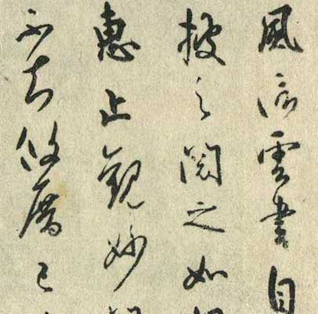
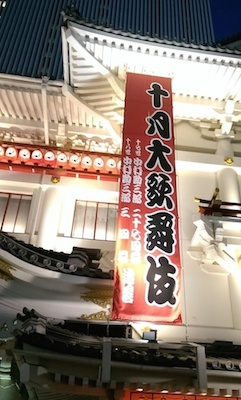
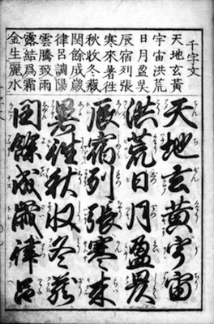
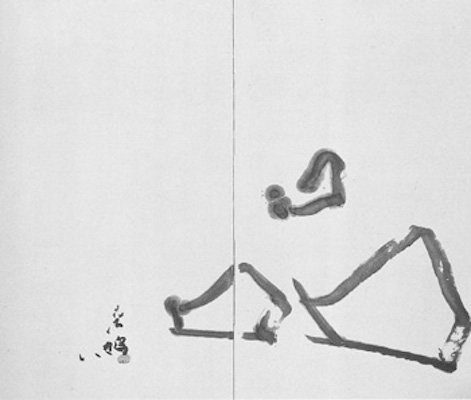
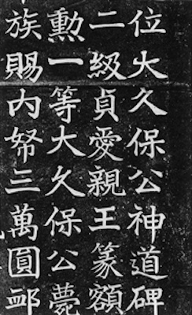
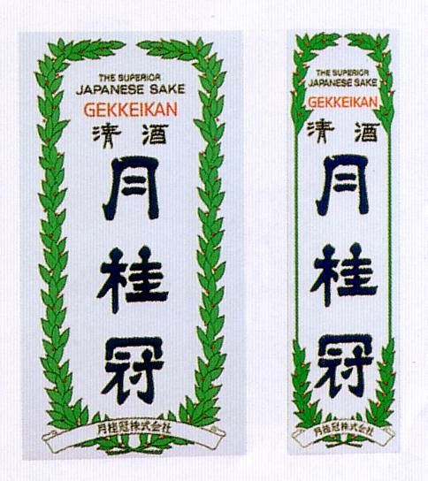
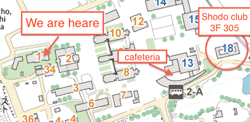

書道 -Shodo-
==

## Japanese calligraphy
#### Japanese culture 4:  Understanding Japan through Japanese traditional culture

by Kento Ito @Randyumi

About me
--
<!-- data-scale="3" -->
<!-- data-rotate-y="45" -->

* I am ...
  * 伊藤 健斗Ito Kento(@Randyumi)
  * 
  * living at: Tokyo
  * a web engineer(occupation)
  * a graguate of Tohoku Univ. Arts and Letters, 2013

Today
--

Do you know about **書道shodo**?
--
**書道shodo** is known as Japanese calligraphy.

* other language:
  * 书法/ 書法(Chinese), 서예(Korean), Thư Pháp(Vietnam).

Maybe...?
--

* Almost Japanese students have exprerience in *shuji(習字)*?
* Chinese or Taiwanese stutdents have any knowlage?
  * have you ever learned shodo?
* Other country students do not know well?

Today's agenda
--
* 書道shodo history
* example of works
* experience

Something like these
--

風信帖 / 空海(810年)

Fushinjo by Kukai (written in 810?)

Something like these
--

高野切第一種 / 伝・紀貫之

Koyagire vol.1 / Kinotsurayuki

History(Japan)
--
* 和様wa-yo(Japanese style) and 唐様kara-yo(Chinese style)
* Calligraphy originated in China
  * originated in Chinese carigraphy
  * introduced in Japan about 1300 years ago
    *  by 遣唐使kento-shi(missions to China)
  * started from Chinese style 唐様kara-yo

History(Japan)
--
* Japanese style is formed
  * 遣唐使kento-shi(missions to China) was abolished in 894
  * Japanese original culture was developed
    * Japanese style 和様wa-yo is developed too

History(Japan)
--
* Kana(Hiragana) is origin of Wayo

History(Japan)
--
* Chinese characters accord to Wayo

* 御家流(O-ie-ryu) style character spread in Japanese people 
  * in 江戸時代Edo-period, about 300 - 100 years ago
* Edo goverment used 御家流Oieryu as an official form of characters

和様 the Japanese style
--
御家流Oieryu in today

History(Japan)
--
* 和様 was deprecated in Meiji period
  * Edo period was ended and new goverment was established
  * a lot of old culture was nagated
    * character of 和様 was one of such an old culture

Current
--
* Today's *shodo* is based on 唐様kara-yo
  * Today's shodo is an art
  * little needs on practical use
  * readability is not important
  * beautiness is more important

Current
--
<!-- id="big" -->
  <b>愛</b>

love

Current
--

愛 / 上田桑鳩1951年

Ai / Sokyu Ueda(1951)

Current
--
<b>愛</b> or  <b>品</b>

Current
--

大久保公神道碑 / 日下部鳴鶴

Okubo-Koshindo-hi / Mekaku Kusakabe

Current
--
familier work

Recent
--
Manga(comic)

 

Recent
--
Shodo performace

Recent
--
Shodo performance

<iframe width="420" height="315" src="http://www.youtube.com/embed/02mi8dH80gY?t=2m3s" frameborder="0" allowfullscreen></iframe>

How to write
--
* little point in writing characters
	* Writing character **BEAUTIFULLY** is most important
* using BRUSH(筆), INC(墨), PAPER(紙)
* model works are prepared (for students submitted home work)

HaveFun!
--
* Tips
  * too much ink will blured on paper
  * brush must not be layed
  * take care the tip of brush

More
--
More learning and enjoying shodo, go to **shodo club**

Twitter / @bokubokuyou

* This slides is uploaded in GitHub
  * https://github.com/randyumi/misc

